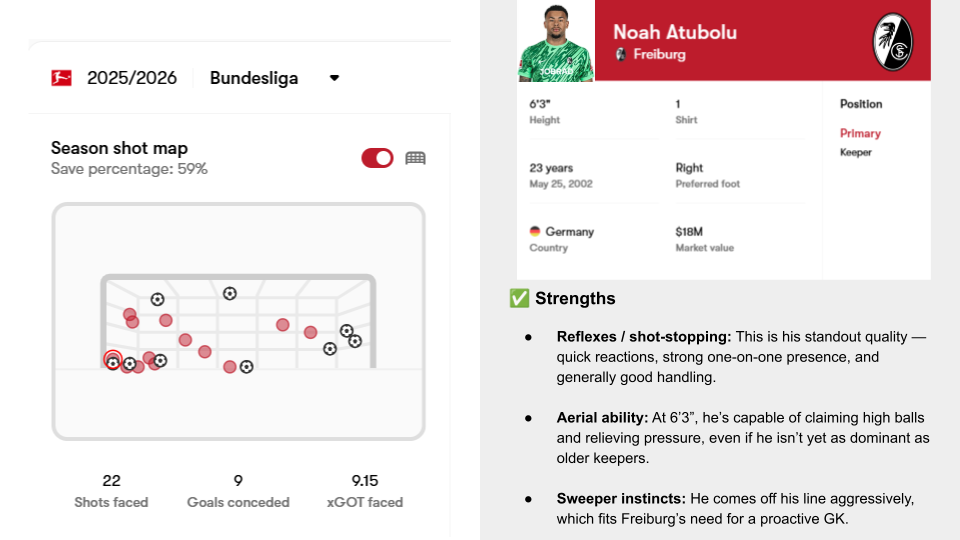

# SC Freiburg – Scouting Report (2025/26)

📊 One-page view on Freiburg’s Badische Derby victory

## 🔎 Highlights
- Balanced start: 2W – 1D – 2L (9 scored, 9 conceded)
- Tactical trends: Defend as a unit, still needs more creativity / quality going forward
- Player spotlights: 
  - 🧤 Noah Atubolu – strong shot-stopper, still improving with his feet
  - 🎯 Vincenzo Grifo – elite set-piece creator, Freiburg’s heartbeat in attack

---

## 🧤 Player Spotlight: Noah Atubolu

---

## 📂 Files
- [Full PDF Report](./SC%20Freiburg%20-%20Scouting%20Report.pdf)
